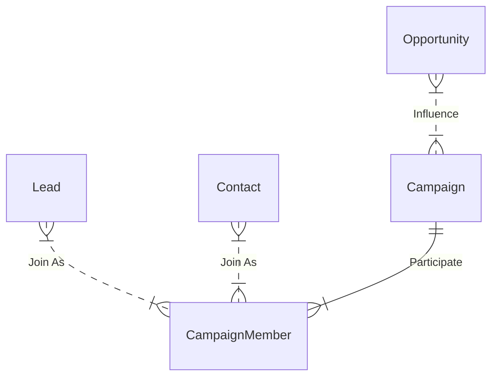

---
layout: post
title: "Campaign Member Status Tracking"
date: 2023-09-11
description: "Campaign Member Status Tracking in Salesforce"
tag: Salesforce
---   

## Data Model In Salesforce Sales Cloud

> ** How to Track: ** Leads and Contacts can add as Campaign Members who will participate  the Campaign. And in Salesforce there is a filed Status to track the engagement of the Campaign, say the Campaign member 'Accepted' or 'Attended' a Webinar Campaign.